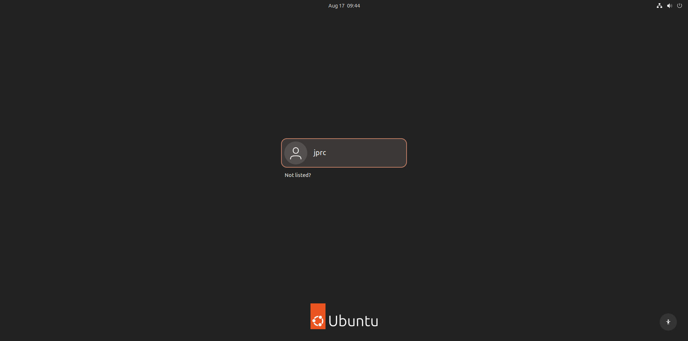

## 🎯 Objective

The goal is to build a small SOC environment consisting of:

* 🐧 Ubuntu → Splunk SIEM
* 🐉 Kali Linux → Attacker machine
* 🪟 Windows Server 2022 / Windows 10 → End device / victim
* 📡 Splunk Universal Forwarder → Sends Windows security logs to Splunk

## ⚙️ Steps to Set Up the SOC Home Lab

### 🖥️ Step 1: Install VirtualBox

Download and install **Oracle VirtualBox** on the host machine.

VirtualBox will be used to create and run the virtual machines for the SOC Home Lab.

---

### 💿 Step 2: Download the Operating Systems

Download the ISO files for the operating systems that will be used in the lab:

* 🐧 **Ubuntu** → Splunk SIEM
* 🐉 **Kali Linux** → Attacker
* 🪟 **Windows Server 2022 / Windows 10** → End Device / Victim

---

### 🐧 Step 3: Install Ubuntu

Create a new virtual machine in VirtualBox and install **Ubuntu** using the downloaded ISO file.

Ubuntu will be used to host **Splunk Enterprise**.

---

### 🐉 Step 4: Install Kali Linux

Create another virtual machine in VirtualBox and install **Kali Linux** using the downloaded ISO file.

Kali Linux will be used as the **attacker machine**.

---

### 🪟 Step 5: Install Windows

Create another virtual machine in VirtualBox and install **Windows Server 2022 / Windows 10** using the downloaded ISO file.

This machine will be used as the **end device / victim**.

---

### 📊 Step 6: Install Splunk Enterprise on Ubuntu

After installing Ubuntu, download and install **Splunk Enterprise**.

Splunk Enterprise will be used as the **SIEM** to collect, search, and analyze security logs from the Windows endpoint.

---

### 📡 Step 7: Install Splunk Universal Forwarder on Windows Server 2022

After installing Windows, download and install the **Splunk Universal Forwarder**.

The Universal Forwarder will collect Windows security logs and send them to the Splunk Enterprise server running on Ubuntu.

---

### 🌐 Step 8: Configure the Lab Network

Configure the virtual machines so that **Ubuntu, Kali Linux, and Windows** can communicate with each other.

Then configure the **Splunk Universal Forwarder** on Windows to forward Windows security logs to the **Splunk Enterprise server** running on Ubuntu.

The basic log flow will be:

--- 

## 🖥️ Final Lab Environment

The SOC Home Lab consists of three virtual machines, each with a specific role:

* 🐉 **Kali Linux** → Attacker
* 🪟 **Windows Server 2022** → End Device / Victim
* 🐧 **Ubuntu** → Splunk SIEM

### 🐉 Kali Linux — Attacker

Kali Linux will be used to simulate attacks against the Windows endpoint.

---

### 🪟 Windows Server 2022 — End Device

Windows Server 2022 will act as the monitored endpoint. The **Splunk Universal Forwarder** will collect and forward its security logs to Splunk.

---

### 🐧 Ubuntu — Splunk SIEM

Ubuntu will host **Splunk Enterprise**, which will receive, search, and analyze the security logs collected from the Windows endpoint.

---

At this point, all virtual machines are installed and the basic SOC Home Lab environment is ready for the next stage.