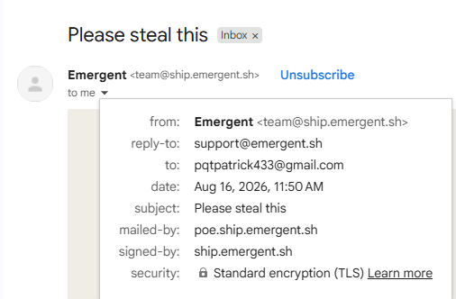
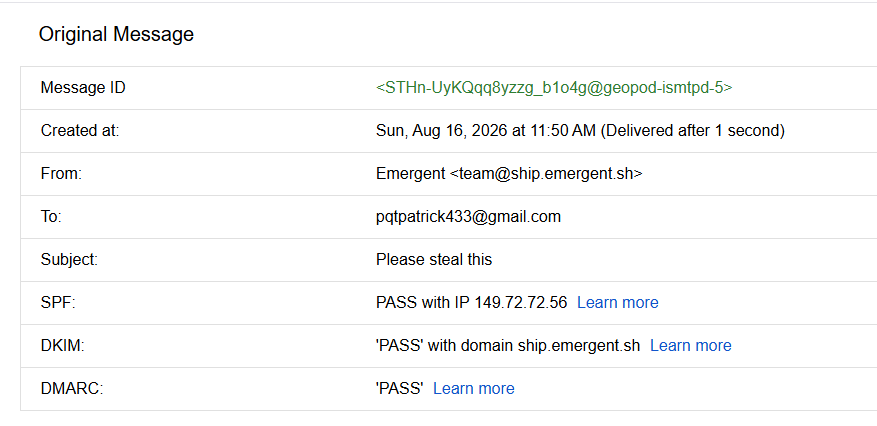

#  03: Email Security Analysis

---

## 🎯 Objective

The goal of this investigation is to analyze a suspicious email and determine whether it contains indicators of **phishing, malware, spam, or other malicious activity**.

The investigation focuses on:

- 🔎 Analyzing email headers
- 🔐 Verifying email authentication results
- 🌐 Investigating the sender domain and sending IP
- 🔗 Reviewing URLs contained in the email
- 📎 Checking for malicious attachments
- 🕵️ Identifying Indicators of Compromise (IOCs)
- 📊 Determining the overall risk of the email

The email was analyzed using the available email security and reputation results.

> **Note:** Screenshots in this documentation can be added from the investigation results.

---

## 📧 Email Information

The analyzed email contained the following information:

| **Field** | **Value** |
|---|---|
| **From** | `Emergent <team@ship.emergent.sh>` |
| **To** | `pqtpatrick433@gmail.com` |
| **Subject** | `Please steal this` |
| **Reply-To** | `support@emergent.sh` |
| **Return-Path** | `bounces+59748521-f977-pqtpatrick433=gmail.com@poe.ship.emergent.sh` |
| **Message-ID** | `<STHn-UyKQqq8yzzg_b1o4g@geopod-ismtpd-5>` |
| **Sending IP** | `149.72.72.56` |
| **Attachment** | None |

### 📸 Email Screenshot




---

# 🔎 Investigation

## 🔐 Step 1: Analyze Email Authentication

The first step was to review the email authentication results to determine whether the message successfully passed the sender verification mechanisms.

The supplied analysis showed:

```text
SPK PASS
DKIM PASS
DMARC PASS
```

### DKIM

**DKIM: PASS**

DKIM indicates that the email contained a valid cryptographic signature that successfully passed verification.

### DMARC

**DMARC: PASS**

DMARC passing indicates that the email passed the sender's domain-based authentication policy.

These results are positive indicators when evaluating the legitimacy of an email.

### 📸 Authentication Results



---

## 🌐 Step 2: Analyze the Sending IP Address

The sending IP address identified from the email headers was:

```text
149.72.72.56
```

The supplied security analysis reported:

```text
IP Reputation: Clean
```

This indicates that the IP address did not have a negative reputation according to the analysis performed.

### 📸 IP Reputation Screenshot Via VirusTotal


---

## 🏢 Step 3: Analyze the Sender Domain

The sender used the following domain:

```text
emergent.sh
```

The supplied analysis reported:

```text
Domain Reputation: Clean
```

The email also used related subdomains such as:

```text
ship.emergent.sh
poe.ship.emergent.sh
links.emergent.sh
```

The domain reputation result was considered a positive indicator during the investigation.

### 📸 Domain Reputation Screenshot Via VirusTotal


---

## 🔗 Step 4: Analyze the URLs

The email contained URLs using:

```text
https://links.emergent.sh/v1/emailclick
```

The URLs contained long encoded parameters.

The supplied analysis reported:

```text
URL Analysis: Clean
```

The URLs appear to use an email-click tracking mechanism.

Tracking URLs are commonly used by legitimate email services to measure link clicks and redirect users to another destination.

However, the final destination should still be verified before entering credentials or sensitive information.

### 📸 URL Analysis Screenshot Via VirusTotal


---

## 📎 Step 5: Check for Attachments

The email was checked for potentially malicious attachments.

The analysis reported:

```text
Attachment Analysis: No Attachment
```

No files were attached to the email.

This means there was no direct attachment-based malware indicator identified during the investigation.

### 📸 Attachment Analysis Screenshot


---

## 🦠 Step 6: Check for Malware Indicators

The supplied analysis reported:

```text
Malware Indicators: Clean
```

No malware indicators were identified.

There were also:

```text
File Hashes: N/A
File Names: N/A
```

Because the email did not contain an attachment, there were no file hashes available for analysis.

---

## 🎣 Step 7: Check for Phishing Indicators

The supplied analysis reported:

```text
Phishing Indicators: Clean
```

No phishing indicators were identified.

The subject line was:

```text
Please steal this
```

Although the subject is unusual and attention-grabbing, the subject alone is not enough to classify the email as phishing.

The sender authentication, reputation, URLs, and other available indicators were also considered.

---

## 🚨 Step 8: Review Spam Characteristics

The main negative indicator identified during the investigation was:

```text
Spam Characteristics: Excessive links
```

The email contained multiple long tracking URLs.

This may cause automated security systems to classify the email as having spam-like characteristics.

However, excessive links do not automatically mean that an email is malicious because legitimate marketing and transactional emails commonly use tracking links.

### 📸 Spam Analysis Screenshot


---

# 🧩 Investigation Flow

The investigation followed this workflow:

```text
                 ┌─────────────────────────┐
                 │      Incoming Email      │
                 │   "Please steal this"    │
                 └────────────┬────────────┘
                              │
                              ▼
                 ┌─────────────────────────┐
                 │    Header Analysis      │
                 │ IP / Sender / Domains   │
                 └────────────┬────────────┘
                              │
                              ▼
                 ┌─────────────────────────┐
                 │ Authentication Checks   │
                 │ DKIM / DMARC / SPK      │
                 └────────────┬────────────┘
                              │
                              ▼
                 ┌─────────────────────────┐
                 │ Reputation Analysis     │
                 │ IP / Domain / URLs      │
                 └────────────┬────────────┘
                              │
                              ▼
                 ┌─────────────────────────┐
                 │ Content Analysis        │
                 │ Attachments / Malware   │
                 │ Phishing / Spam         │
                 └────────────┬────────────┘
                              │
                              ▼
                 ┌─────────────────────────┐
                 │     IOC Collection      │
                 │ IP / Domains / URLs     │
                 └────────────┬────────────┘
                              │
                              ▼
                 ┌─────────────────────────┐
                 │      Final Verdict      │
                 │        🟢 LOW RISK      │
                 └─────────────────────────┘
```

---

# 📝 Investigation Findings

The investigation identified the following information:

| **Category** | **Finding** |
|---|---|
| **Sender** | `team@ship.emergent.sh` |
| **Sending IP** | `149.72.72.56` |
| **IP Reputation** | Clean |
| **Domain Reputation** | Clean |
| **DKIM** | PASS |
| **DMARC** | PASS |
| **SPK** | PASS |
| **URL Analysis** | Clean |
| **Attachment Analysis** | No Attachment |
| **Phishing Indicators** | Clean |
| **Malware Indicators** | Clean |
| **Spam Characteristic** | Excessive links |
| **Overall Assessment** | Low Risk |

---

# 🕵️ IOC Collection

## IP Address

```text
149.72.72.56
```

## Email Address

```text
team@ship.emergent.sh
```

## Domains

```text
ship.emergent.sh
poe.ship.emergent.sh
hey.emergentai.sh
links.emergent.sh
emergent.sh
```

## URL Domain

```text
links.emergent.sh
```

## Message-ID

```text
<STHn-UyKQqq8yzzg_b1o4g@geopod-ismtpd-5>
```

## File Hashes

```text
N/A
```

## File Names

```text
N/A
```

---

# 📊 Analyst Assessment

| **Category** | **Result** |
|---|---|
| **Classification** | Low-Risk Email |
| **Sender Reputation** | Clean |
| **IP Reputation** | Clean |
| **Domain Reputation** | Clean |
| **Authentication** | Passed |
| **URL Analysis** | Clean |
| **Attachment Analysis** | No Attachment |
| **Malware Indicators** | None Identified |
| **Phishing Indicators** | None Identified |
| **Spam Indicator** | Excessive Links |
| **Overall Assessment** | No Confirmed Malicious Indicators |

---

# 🎯 What This Investigation Demonstrated

This email investigation provided hands-on experience with:

- 📧 Email header analysis
- 🔐 DKIM and DMARC verification
- 🌐 IP reputation analysis
- 🏢 Domain reputation analysis
- 🔗 URL investigation
- 📎 Attachment analysis
- 🦠 Malware indicator analysis
- 🎣 Phishing indicator analysis
- 🚨 Spam characteristic analysis
- 🕵️ IOC collection
- 📝 SOC-style investigation documentation

---

# 🚨 Final Conclusion

The investigation did **not identify confirmed phishing or malware indicators** in the supplied email analysis.

The email successfully passed the reported authentication checks:

```text
DKIM: PASS
DMARC: PASS
SPK: PASS
```

The sending IP and domain were also reported as clean, while the URL analysis did not identify malicious indicators.

The email contained **no attachments**, and no malware indicators were identified.

The main negative finding was:

```text
Spam Characteristics: Excessive links
```

The excessive links appear to be associated with email tracking URLs.

Based on the available evidence, the email was classified as:

> **🟢 LOW RISK — No Confirmed Malicious Indicators**

However, this assessment is based only on the supplied analysis. A deeper investigation should examine the full email body and the final destination of the tracking URLs before considering the email completely trustworthy.

---

> **Note:** This analysis was performed for cybersecurity learning and investigation purposes. Screenshots can be added to each investigation step to document the evidence and analysis process.
