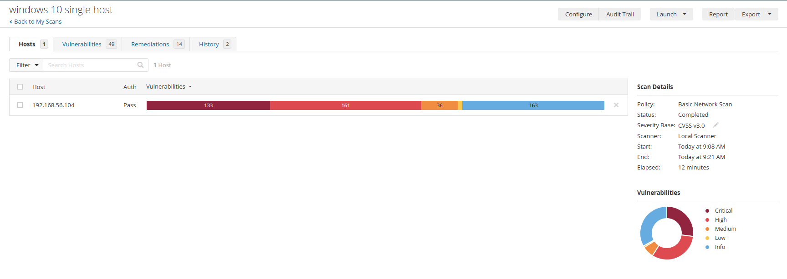

# 04: Vulnerability Assessment & Remediation with Nessus

---

## 🎯 Objective

The goal of this lab is to perform a **vulnerability assessment** against a Windows host using **Nessus** and identify security issues in installed software and system components.

The assessment follows a basic vulnerability management workflow:

**Discover → Prioritize → Assess → Remediate → Verify**

---

## 🖥️ Lab Environment

The assessment used:

- 🪟 **Windows 10** → Target endpoint
- 🛡️ **Nessus Essentials** → Vulnerability scanner

---

## 🔎 Step 1: Discover

A network scan was performed against the Windows host to identify exposed services and remotely detectable vulnerabilities.

The initial scan produced limited vulnerability findings.

---

## 🔐 Step 2: Authenticated Scan

Windows credentials were configured in Nessus to perform a deeper **authenticated vulnerability scan**.

This allowed Nessus to inspect the host for:

- Installed software
- Software versions
- Missing security updates
- Vulnerable Windows components

An outdated version of **Mozilla Firefox** was intentionally installed to simulate a vulnerable application.

---

## ⚠️ Step 3: Prioritize & Assess

The authenticated scan identified multiple vulnerabilities.

The findings were reviewed and prioritized based on severity and potential risk.

Examples included:

- Outdated Mozilla Firefox
- Missing Microsoft security updates
- Vulnerable Microsoft applications and components

---

## 🛠️ Step 4: Remediate

Selected vulnerabilities were remediated by:

- Updating vulnerable software
- Installing applicable Windows security updates
- Removing unnecessary vulnerable applications where appropriate

Nessus remediation recommendations were used to guide the remediation process.

---

## ✅ Step 5: Verify

A follow-up Nessus scan was performed after remediation to verify whether the selected vulnerabilities were resolved.

The results were compared with the previous scan to determine the effectiveness of the remediation.

From 133 down to 10 Critical Severity

---

## 📊 Key Findings

| Assessment | Result |
|---|---|
| Initial Network Scan | Limited findings |
| Authenticated Scan | Multiple vulnerabilities identified |
| Scanner | Nessus Essentials |
| Target | Windows 10 |
| Assessment Type | Authenticated Vulnerability Assessment |
| Remediation | Software updates / Windows patches |
| Verification | Follow-up Nessus scan |

---

## 🎯 What This Lab Demonstrated

- 🔎 Vulnerability scanning with Nessus
- 🔐 Authenticated vulnerability assessment
- ⚠️ Vulnerability prioritization
- 🛠️ Vulnerability remediation
- ✅ Remediation verification
- 📝 Basic vulnerability management workflow

---

> **Note:** All scans and remediation activities were performed in a controlled lab environment for learning and security testing purposes.